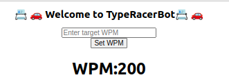
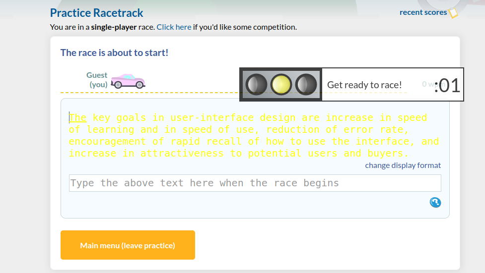
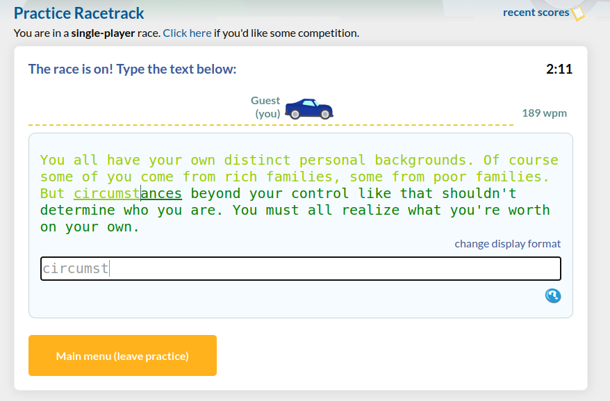
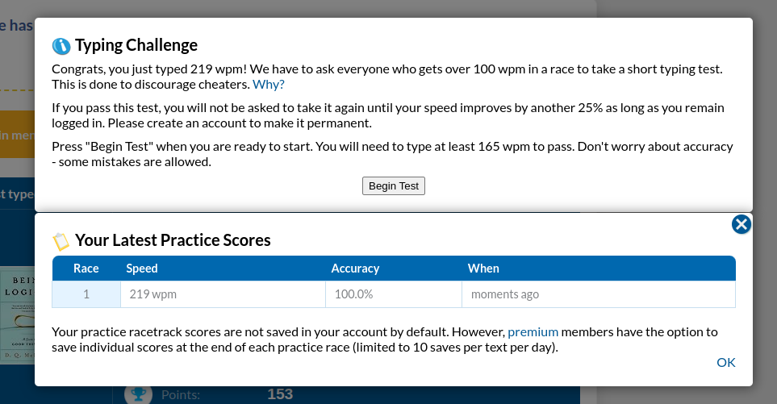

<h1 style="font-size: 1.25rem;">📇 🚗 Welcome to TypeRacerBot📇 🚗 </h1>

Typeracer is an online Words Per Minute typing game, this extension enables the user to rapidly insert the necessary characters to achieve ridiculously high Words Per Minute.

Gif Preview: https://imgur.com/bk1esPm

How to use:
1. Clone this repository.
2. Navigate to chrome://extensions/
3. Enable developer mode in the top right corner.
4. Click "Load Unpacked" in the top left corner.
5. Select the cloned repository.
6. Navigate to https://play.typeracer.com/
7. Click the extension icon in the top right corner of your browser.
8. Enter your desired WPM target and click "Set WPM".This value will be an approximate value, as the script will attempt to match the target WPM, but will not be exact.

9. At game start, the text will turn yellow, indicating the text has been copied but not yet able to be written.

10. Once the timer reaches 0, the text will turn green indicating the race has started.
The input field will automatically be focused, and the text will begin to be typed. No input is required from the
user.

11. Once you have completed the race, a warning will appear if you completed over 100wpm asking to
retest. This is the
extent of the script as it's purpose is to prank friends and not to actually cheat in official races. Tell your
friends the "race again" option isn't working, then reload the page to race again.

12. Congrats, you are now a TypeRacer Master!

